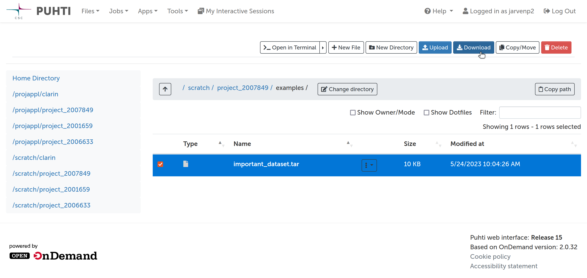
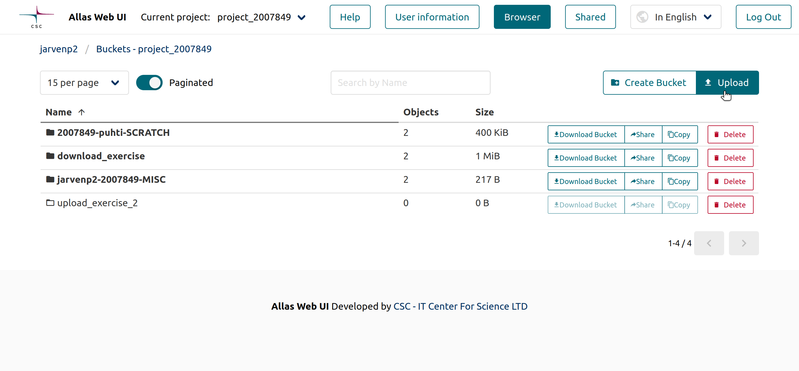

# In This Session

- Data management options after analysis has been completed:
  - Download to your own computer
  - Store in Allas
  - Bonus: Fairdata services
  - Bonus: Digital preservation service

# Motivation

If you don't actively manage your data, it will:

- not benefit others
- not bring you citations
- not exist at all after a while

# Downloading Data from Puhti: Web Interface

# Downloading Data from Puhti: Web Interface

Pros:

- Easy
- No need to apply for resources
- Does not require a valid project/account in the long term
- Negligible long term cost

Cons:

- Less suitable for huge data sets
- Sharing is troublesome
- Data loss can still easily happen (e.g. lost, damaged, corrupted or obsolete media)

# Allas

Pros:

- Someone else takes care of hosting the data
- Sharing the data with specific people is easy
- Opening the data for everyone is easy
- Can be operated via command line (e.g. on Puhti or a linux machine) or [web interface](https://allas.csc.fi)

Cons:

- Requires an active project
- Not long term (years, not tens of years)
- Limit for number of objects within a bucket

# Allas: Object Storage

- Not directories and files but _buckets_ and _objects_
- Very small difference for a casual user

# Allas Upload: Web UI

# Allas Upload: Directly from Puhti

<ol>
  <li style="margin-bottom:10px">Demonstration</li>
  <ul>
    <li>Uploading files</li>
    <li>Checking what has been uploaded</li>
    <li>Downloading via command line</li>
  </ul>
  <li style="margin-top:26.8px">Try it yourself</li>
</ol>

# Bonus: Fairdata Services

Pros:

- No running billing unit cost for storage space
- Sharing the data is easy
- Ready-made tooling for providing metadata together with the data
- Data is findable
- Accidental removal or alteration of data is not likely

Cons:

- Requires an active project (but there are processes for transferring project managership)
- Not for data sets containing special categories of personal data

# Bonus: National Digital Preservation Service

Pros:

- **Very** reliable

Cons:

- Not designed for sharing
- Costly and thus available only for selected data sets
- Limited file formats and strict submission processes

<!--
# License Categories

{width=30%}
{width=30%}
{width=30%}

- [lbr.csc.fi](https://lbr.csc.fi)
- Service in which you can apply for access to RES licensed resources
- Fields vary depending on the resource, at least purpose of use in all forms

-->
