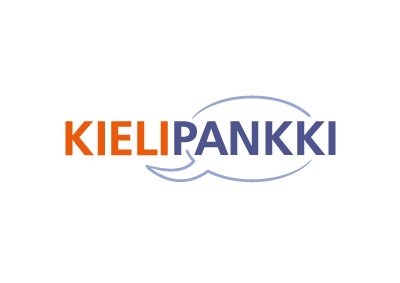
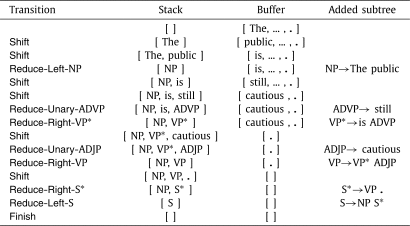
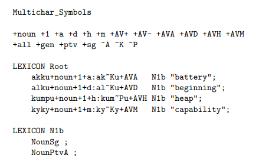
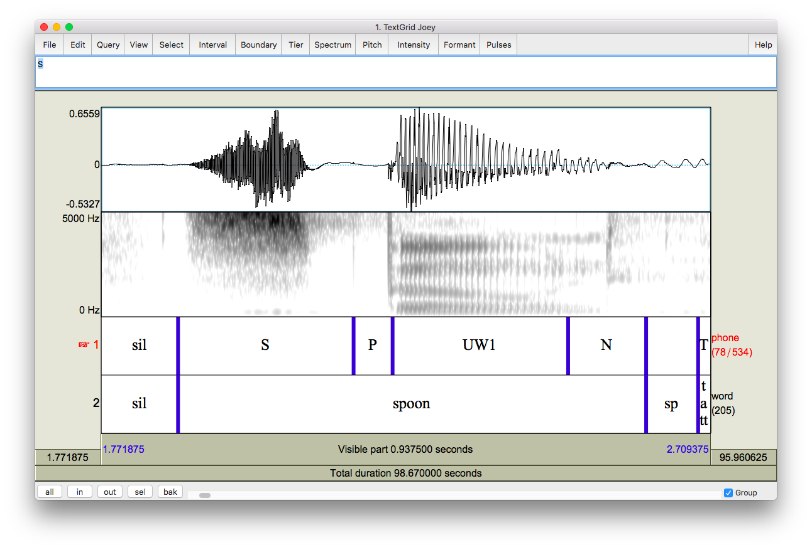
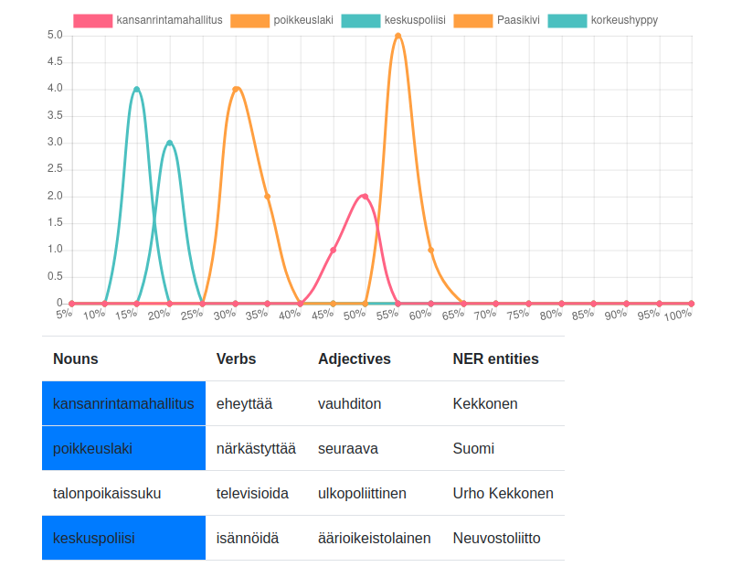
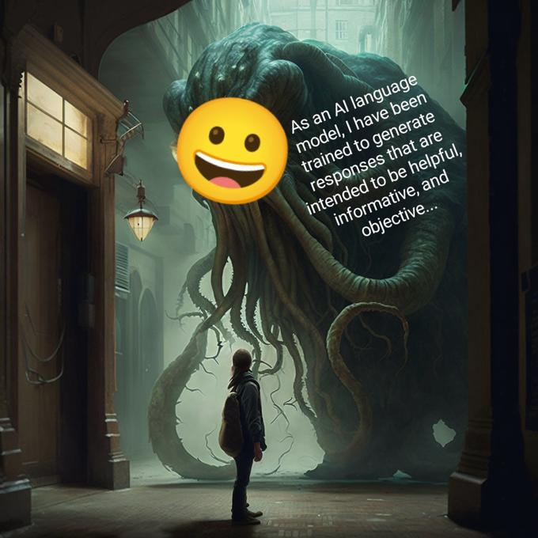
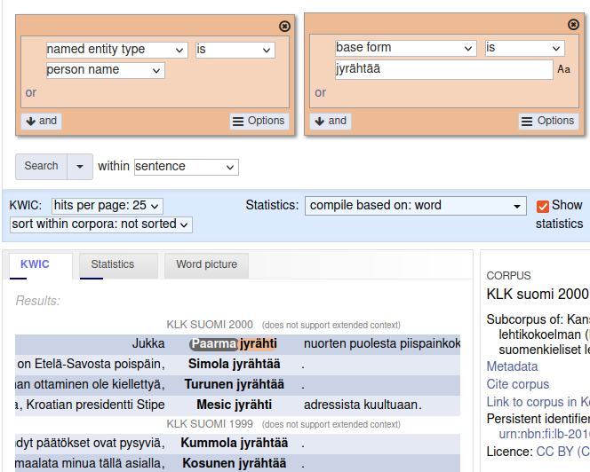

# Kielipankki & CSC {.title}

Corpora, language technology, computational linguistics, corpus linguistics, supercomputers and all that

 Sam Hardwick

# Kielipankki 

## AKA The Language Bank of Finland

* We create, solicit and receive corpora

* We enrich the corpora with NLP tools

* We make them available through browsing interfaces, downloads and computing environments

* We make available our enriching tools, plus others

* Hundreds of corpora, tens of billions of words

# CSC

* Owns and operates computational resources and services

* Our own cloud, network, supercomputers, storage solutions

* Kielipankki uses CSC resources, and helps language-oriented users use them

# What can we do with language?

## Computational linguistics

<!-- Image credits? http://www.ling.helsinki.fi/~klinden/pubs/sfcm09hfst.pdf https://www.sciencedirect.com/science/article/abs/pii/S000437021830540X https://joeystanley.com/blog/a-tutorial-on-extracting-formants-in-praat -->

* Linguistics from a computer science perspective: formalisms, parsing, rule-writing

* We have and use tools for this

* We will not focus on this in this course

# What can we do with language?

## Language technology

* Arguably a rebrading of computational linguistics for the 90's-2000's 

* More application-oriented and uses statistics

* More computation

* We have a bonus problem set on topic modeling in this course

# What can we do with language?

## Corpus linguistics

* Statistics on a body of text 

* Can use tool-generated information: morphology, syntax, semantics etc.

* Arguably Kielipankki's main focus, we will do a project in this course

# What can we do with language?

## Modern large-scale machine learning

* This is what you read about in the headlines

* Generic statistical approaches, no linguistic content

* Huge amounts of data and computation, cutting-edge applications

* A lot of this goes on at CSC, but we won't do it in this course

# Kielipankki resources: Korp

* A browser for corpora

* Developed by Språkbanken (our Swedish sister organisation)

* Advanced search features, supports some statistics views

# Kielipankki resources: Corpora

* <a href="https://www.kielipankki.fi/tools/">https://www.kielipankki.fi/tools/</a>

* Many modalities (text, speech, video, structured, scanned pages)

* Some available on Korp, some as downloads, some as both

* From completely open to very restricted

* Text usually annotated with metadata, part of speech, base form, morphology, dependency syntax

* We can also annotate named entities, sentiment, geospatial information etc.

# Kielipankki resources: Tools

* <a href="https://www.kielipankki.fi/tools/">https://www.kielipankki.fi/tools/</a>

* Hosted tools: run on our machines, interact via the web (eg. WebAnno for manually annotating text)

* Downloadable tools: tools maintained by us that you can run on your own machine (eg. `finnish-tagtools`)

* Software installed on our HPC platforms, need to log in there to use them

# CSC resources: Data storage

* HPC has a lot of capacity for temporary data

* IDA, long-term storage for FAIR research data is hosted at CSC

* Users have access to:
    * an object storage system (Allas)
	* a hosted database service (Kaivos)
	* encrypted data storage via SD desktop

# CSC resources: Cloud computing

* Virtual servers (Pouta), you can host long-running services and websites here

* Container cloud (Rahti), same but with containers

* Notebooks, an instant programming environment

# CSC resources: HPC (High-Performance Computing)

* Access usually via a command line, or a browser-based app

* **Puhti** -- General purpose. 682 CPU nodes, each with 40 cores + 80 Nvidia GPU nodes - we'll be using this through Jupyter in the browser!

* **Mahti** -- Larger-scale jobs. 1404 CPU nodes, each with 128 cores, 180K CPU cores total! 24 GPU nodes, but very beefy ones (4 Nvidia A100's).

* **Lumi** -- GPU-specialised jobs. Over 10K AMD GPUs. That's a lot of compute (#3 in the world!).

# Finally

What do I hope that you will take home from this couse?

* An awareness of the existence of enriched data, and how easily you can use it to study interesting questions about the data

* An awareness that the environment for doing computational tasks is there for you, and you _can_ learn to use it

* If you haven't already had it, a taste of programming - and if you have, do the bonus problem and get a taste of parallelism!

# License

<small>The text content of this presentation is (c) 2023 by CSC – IT Center for Science Ltd.

CSC's contributions are licensed under a **Creative Commons Attribution-ShareAlike** 4.0 Unported License, [http://creativecommons.org/licenses/by-sa/4.0/](http://creativecommons.org/licenses/by-sa/4.0/).

Image credits:

Lexc screenshot from Lindén, Silfverberg, Pirinen, "HFST Tools for Morphology – An Efficient Open-Source Package for Construction of Morphological Analyzers"

Shift-reduce screenshot from D. Fernández-González, C. Gómez-Rodríguez, "Faster shift-reduce constituent parsing with a non-binary, bottom-up strategy"

Praat screenshot used with permission from Joey Stanley

Unattributed Shoggoth image downloaded from https://knowyourmeme.com/memes/shoggoth-with-smiley-face-artificial-intelligence

Other images (c) CSC

</small>
