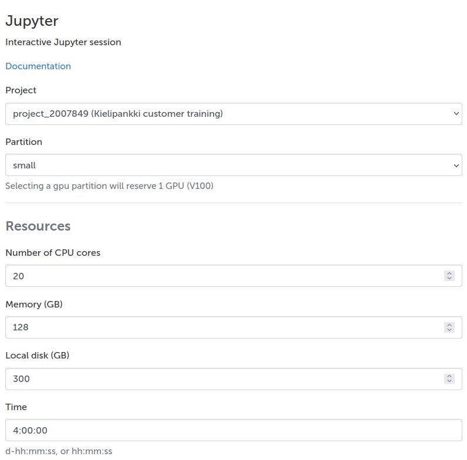
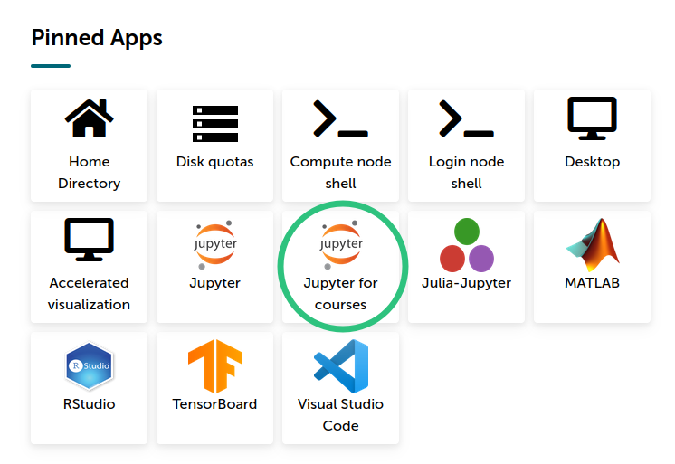
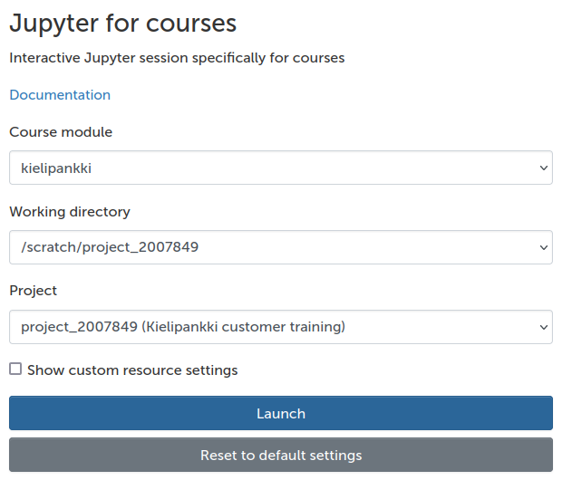
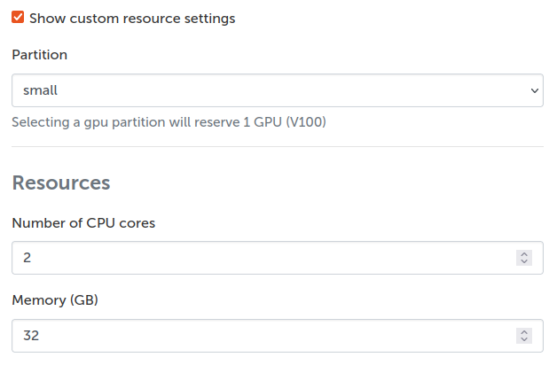

# Processing a corpus with Jupyter on a supercomputer {.title}

 Sam Hardwick

# Jupyter

* Edit code in your web browser, have it run on a remote machine, and display the results in a nice way in a "Notebook"

* Also launch terminals, upload / download files, edit text, and even run clusters, so it can be a full interface

* Mainly used with **Ju**lia, **Pyt**hon (which we'll use) and **R**

# Jupyter on Puhti

* We'll be running Jupyter on Puhti

* You tell a web interface what resources you want, and they appear at your fingertips

* You may have to wait for the resources to become available, especially if you asked for a lot

* The full Puhti environment, with file system and software modules available

# Supercomputer use

* It's a supercomputer, so the code will run super fast, right?

* Well...

. . .

* No

. . .

* In this case, where we'll be running a single process interactively, no faster than your laptop, except that your laptop would probably run out of RAM

# So what's the point?

* Supercomputers have fast processors, but so does your laptop

* But the supercomputer has thousands of processors, petabytes of storage, a fast network connection, tons of RAM, and a pile of GPUs

* If you can leverage these resources, you will be able to do things you can't do without them

* But even if not, you get a stable, shared, always-on environment

# Jupyter for courses

* This is a special Jupyter environment where we've set everything up for you 

* Access it through [puhti.csc.fi](puhti.csc.fi) by clicking on "Jupyter for courses"

# Jupyter for courses - launching

* Choose "kielipankki" as the course module, and set the project and working directory for this course's project's `scratch` directory.

* After clicking "Launch", your session will be queued, meaning that if the system is fully booked, you have to wait. Eventually a button will appear offering to "Connect to Jupyter".

# Jupyter for courses - troubleshooting

* If your session is queued for a long time, you can try switching partitions 

* `Show custom resource settings` lets you change the resource settings, in particular the `Partition`. Sometimes the default `interactive` partition is fully occupied, and it makes sense to delete your session and start a new one in the `small` partition.

* But for troubleshooting, write in the chat, in the HedgeDoc, or otherwise ask for help.
