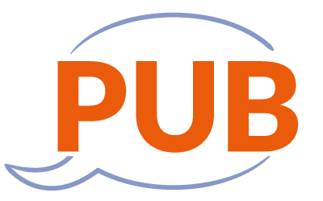
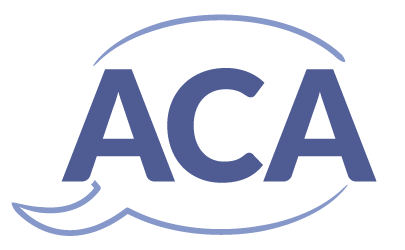
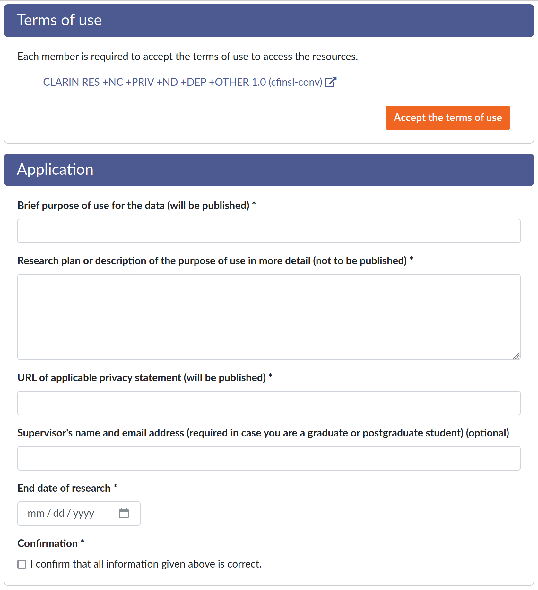

# In This Session

- What kinds of licenses can resources offered via the Language Bank have?
- How to access the resources?
- What you can do with them?
- What about very restricted data?

# License Categories

{width=30%}
{width=30%}
{width=30%}

- Broad categories
- Outline the process you need to follow to get access to the resource
- Further license conditions can and often will apply!

# PUB Resources

- Publicly distributed resources
- No login required
- Other conditions may apply:
  - attributing the original creator
  - sharing your creations with same license
  - non-commercial use only
  - ...

# ACA Resources

- Resources that are available for academic users
- Login required
- Other conditions may apply:
  - attributing the original creator
  - sharing your creations with same license
  - non-commercial use only
  - ...

# RES Resources

- The most restricted license category
- Often contain copyrighted material and/or personally identifiable information
- Accessing a resource requires filling an application
  - Authenticated applicant
  - Explicit agreement to license terms
  - Research plan
  - Possibly other requirements too, e.g. specific affiliation or submitting a privacy statement

# LBR

- [lbr.csc.fi](https://lbr.csc.fi)
- Service in which you can apply for access to RES licensed resources
- Fields vary depending on the resource, at least purpose of use in all forms

# LBR: privacy statement

- GDPR requirement when personally identifiable information is handled
- A document crafted specifically for your research
- Universities etc usually provide templates and support

# Bonus: Sensitive Data

At the time of writing, Language Bank does not provide resources that would be so sensitive that special measures such as encryption at rest would be needed. That will likely change in the future, and users might also have sensitive data sets of their own.

Various kinds of data can be sensitive:

- Sensitive personal data (health data, ethnicity...)
- Ecological data (exact locations of [very old specimens](https://en.wikipedia.org/wiki/Methuselah_(tree)), details of conservation efforts...)
- Confidential data (trade secrets...)

# Bonus: Sensitive Data Services

- CSC offers services for storing and sharing (SD connect) as well as processing (SD Desktop) sensitive research data
- Services for publishing and reusing sensitive data are being piloted
- For more information, see [docs.csc.fi](https://docs.csc.fi/data/sensitive-data/) and [research.csc.fi](https://research.csc.fi/sensitive-data)
