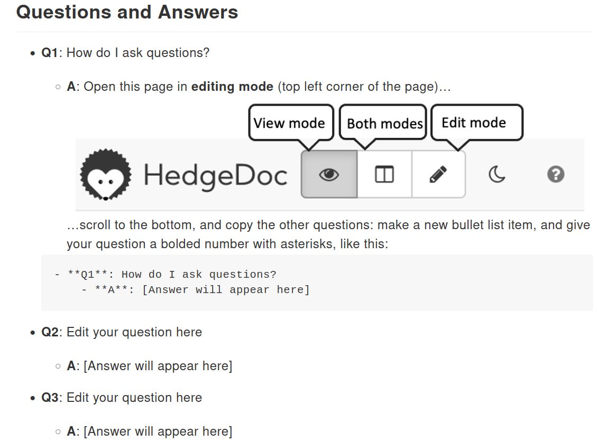

# Practicalities

- Agenda, instructions and Q&A visible in collaborative HedgeDoc: [https://siili.rahtiapp.fi/kielipankki-training](https://siili.rahtiapp.fi/kielipankki-training)
- Presentations and demonstrations in main Zoom room
- Exercises in breakout rooms
  - Each room has one person from Language Bank who can help

# Agenda

## Day 1
- Language Bank and CSC introduction
- Language resources and their licensing in Language Bank
- Using Korp to investigate a research question
- Obtaining data to Puhti for research

## Day 2
- Research on Puhti using Jupyter Notebooks
- Data management options after active research

# Zoom Practices

- Mute your microphone when not talking
- Questions in Zoom or [the collaborative document](https://siili.rahtiapp.fi/kielipankki-training?)
- Exercises in breakout rooms
- Reactions for indicating how you are doing

# Questions and Answers in [HedgeDoc](https://siili.rahtiapp.fi/kielipankki-training)

# Code of conduct

- Let's be friendly and respectful
  - Use welcoming and inclusive language
  - Be respectful of different viewpoints and experiences
  - Gracefully accept constructive criticism
  - Focus on what is best for the community
  - Show courtesy and respect towards other community members
