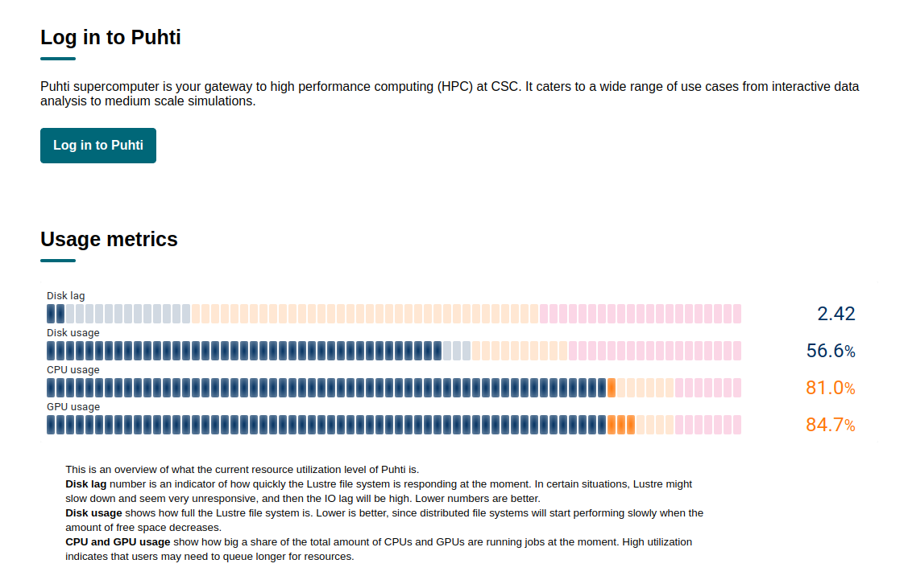
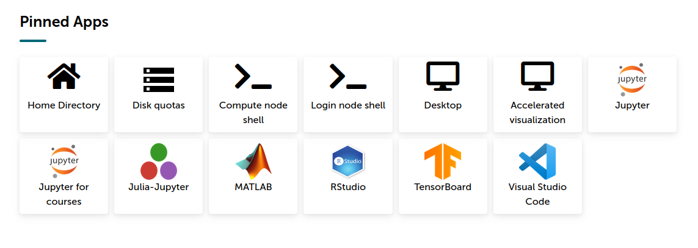
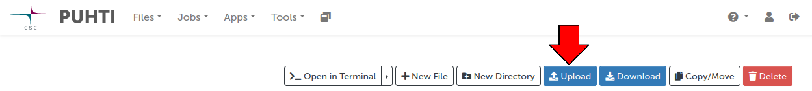

Puhti already has pre-existing language resources, but only for those users who are members of the `kieli` group. For the purposes of this course, we won't assume anything beyond just having a user account in the CSC project for this course. And fetching and processing data is something you'll be doing a lot anyway.

In this tutorial we will:

1. Log into Puhti's web-based file manager
2. Navigate to the course project's "scratch" directory for work-in-progress data
3. If necessary, create a new directory for ourselves
4. Open a terminal window in that directory
5. Type a command into the terminal to download a `.zip` file
6. Type a command into the terminal to unpack the `.zip`

Once you become comfortable with the terminal, you may find it more convenient to just do everything there. But for now we will do things with as little terminal use as possible.

## Preliminaries

We will need either a URL on the Internet to fetch data from, or file on your local computer. The rest of the exercises require the Internet data, so we'll come up with a URL here, but you can also try uploading a small file of your own if you want to try that too.

Downloadable data with a "PUB" license is available from Kielipankki as a public download. If you navigate [Kielipankki's corpus selection](https://www.kielipankki.fi/corpora/), settle on a dataset, and find its location in the download service, you'll be able to get a URL pointing to a file. We will need a file in the [VRT format](https://www.kielipankki.fi/development/korp/corpus-input-format/), which is the format almost all Kielipankki's text resources are distributed as. Right-click on the file name and choose "Copy link".

<video  style="display:block; width:100%; height:auto;" autoplay controls loop="loop">
       <source src="img/download_service_link.webm" type="video/mp4" />
</video>

## Log into the file manager

First, navigate to [puhti.csc.fi](https://www.puhti.csc.fi) in your web browser. Once there, click on the "Log in to Puhti" button and proceed with your authentication provider.



Once logged in, you should see a row of "apps" like this:



The "Home directory" app will launch a file manager that will open in your home directory, which is `/users/<username>`. That is a place just for you, put anything there you want, but up to a rather low limit of 10 GB. For working with data, we're going to go to `/scratch`, the place for large amounts of data that we're working on. Old data there is automatically cleaned from time to time, so don't leave important work lying around there forever.

We won't need this for the other exercises, but just to show you how to upload data from your local computer to Puhti here, you can try the `Upload` button:



## Navigate to `/scratch/project_<project-number>`

In the left-hand side, there should be a list of shortcuts, which allow quick access to the scratch directories of all your projects. We will go to the one for our course like this:

<video  style="display:block; width:100%; height:auto;" autoplay controls loop="loop">
       <source src="img/puhti_web_navigate_to_scratch.webm" type="video/mp4" />
</video>

If for some reason you don't see the shortcut, you can also click on "Change directory" and type in the path you want.

<video  style="display:block; width:100%; height:auto;" autoplay controls loop="loop">
       <source src="img/puhti_web_navigate_to_scratch_2.webm" type="video/mp4" />
</video>

## Create a directory

To keep people getting their files mixed up with each other, it's a good idea for each project member to keep their personal data in their own directory. If there isn't one already, create a folder with the same name as your login name here.

<video  style="display:block; width:100%; height:auto;" autoplay controls loop="loop">
       <source src="img/puhti_web_create_dir.webm" type="video/mp4" />
</video>

## Open a terminal window

Now let's go into our own personal folder, and open a "terminal window". What's a terminal window? Don't worry, it's not the end. It's a place where we can type in commands for the computer to execute. The next few steps are best done that way.

The terminal window will open in a new tab in your browser. The file manager tab will remain usable, and you can switch back and forth between the tabs as needed. The terminal has a "working directory" just like the file manager, and when you start it from the file manager, they will have the same working directory.

<video  style="display:block; width:100%; height:auto;" autoplay controls loop="loop">
       <source src="img/puhti_web_open_terminal.webm" type="video/mp4" />
</video>

(Don't worry about that warning, that's just me. Also, when you connect for the first time, you might get a warning about "`The authenticity of host puhti.csc.fi can't be established`". Just type "`yes`", meaning that we trust that this really is the true Puhti.)

## Download a `.zip` file

We are going to use a program called `wget` to download our file. It's very simple: we simply need to type `wget`, a space character, and then the URL for our file.

Use the URL you got from the preliminaries section, or if you don't want to bother with doing it yourself, you can use the URL `https://korp.csc.fi/download/eduskunta/v1.5/eduskunta-v1.5-vrt.zip`. Paste that after `wget` in the terminal, and you should get a result like this:

<video  style="display:block; width:100%; height:auto;" autoplay controls loop="loop">
       <source src="img/puhti_web_terminal_wget.webm" type="video/mp4" />
</video>

## Unpack the `.zip` file

Now the directory should contain the `.zip` file. You can confirm this by going back to the file manager tab (you might need to reload the page with F5). Or you can write the command to list directory contents by typing `ls` in the terminal. Either way, time for the final step, unpacking the file. To do this, type `unzip <filename>` in the terminal. The terminal knows what files are visible, so you can use the TAB key on your keyboard to autocomplete the file name:

<video  style="display:block; width:100%; height:auto;" autoplay controls loop="loop">
       <source src="img/puhti_web_terminal_unzip.webm" type="video/mp4" />
</video>

The unpacked data is about 2 GB, so it takes a while. Finally, you can type `exit` into the terminal. Then you can close the terminal tab, and in the file manager tab, you can go back to the main view by clicking on "Puhti" in the top left corner, or you can just close the tab.

Done! Congratulations! 

## Extra: taking a look at the data

This is not mandatory, but you might be curious to know what's inside the `.vrt` file. The [specification](https://www.kielipankki.fi/development/korp/corpus-input-format/) is a helpful guide, but briefly, VRT is a mix of XML and tabular data. Each token (word, punctuation mark or other unit) is a line of tabular data, like this:

```
tässä	10	tämä	tämä	Pron	SUBCAT_Dem|NUM_Sg|CASE_Ine	12	det	_	|tämä..pn.1|
```

Each token line has the same number of fields. Here, the token itself is the first field, the second one is the number of the token within its sentence, the next one is its base form, end so on. The first line of a VRT file specifies this ordering of fields.

The XML aspect of VRT gives its structure as a corpus. For example,

```
<text id="1">
<sentence id="1">
Siinä	1	se	se	Pron	SUBCAT_Dem|NUM_Sg|CASE_Ine|CASECHANGE_Up	2	det	_	|se..pn.1|
mielessä	2	mieli	mieli	N	NUM_Sg|CASE_Ine	5	nommod	_	|mieli..nn.1|
on	3	olla	olla	V	PRS_Sg3|VOICE_Act|TENSE_Prs|MOOD_Ind	5	cop	_	|olla..vb.1|
ihan	4	ihan	ihan	Adv	_	5	advmod	_	|ihan..ab.1|
hyvä	5	hyvä	hyvä	A	NUM_Sg|CASE_Nom|CMP_Pos	0	ROOT	_	|hyvä..jj.1|
että	6	että	että	C	SUBCAT_CS	9	complm	_	|että..kn.1|
oikeusministeri	7	oikeusministeri	oikeus|ministeri	N	NUM_Sg|CASE_Nom	8	nn	EnamexPrsTit/	|oikeusministeri..nn.1|
Braxkin	8	Braxkin	Braxkin	N	SUBCAT_Prop|NUM_Sg|CASE_Gen|CASECHANGE_Up|OTHER_UNK	10	poss	EnamexPrsHum/	|Braxkin..nn.1|
on	9	olla	olla	V	PRS_Sg3|VOICE_Act|TENSE_Prs|MOOD_Ind	5	ccomp	_	|olla..vb.1|
paikalla	10	paikka	paikka	N	NUM_Sg|CASE_Ade	9	nommod	_	|paikka..nn.1|
.	11	.	.	Punct	_	5	punct	_	|...xx.1|
</sentence>
</text>
```

Represents a text with id 1, containing one sentence with id 1, with 11 tokens in it. In practice, VRT files almost always have `<text>` and `<sentence>` elements, usually `<paragraph>` elements, and possibly other ones. For example, in the case of `eduskunta.vrt` there are `<utterance>` elements. These elements carry information in their attributes (like the `id="1"` above), relating to time, author, type, or whatever information has been build into the corpus.

Unfortunately, VRT is not a common interchange format, and you will usually have to parse the XML and tabular fields yourself for processing. We do have code available for converting it to other formats, particularly JSON. In the hands-on session we will read it into data structures with some custom code.
