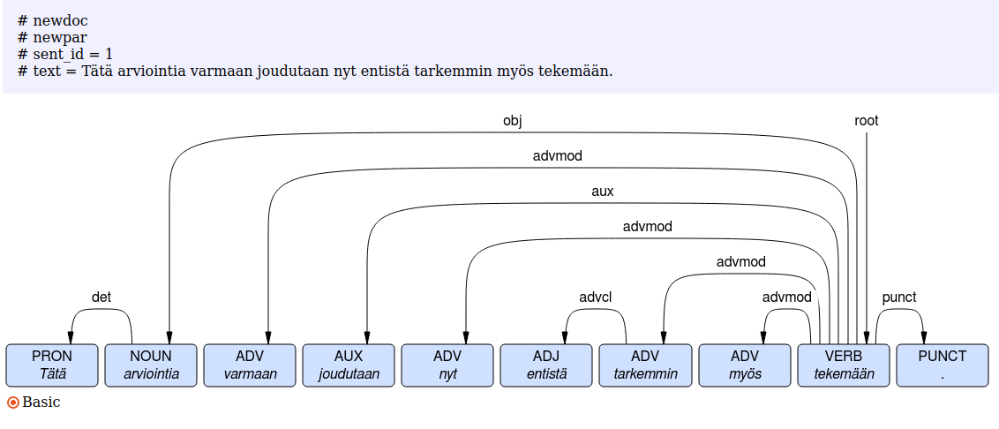

# Discovering datasets with Korp

"Good writing" guides often instruct to remove excess words and direct, simple syntax. An example would be to prefer _I decided_ over _I made a decision_. [This article](https://www.kotus.fi/nyt/kolumnit_artikkelit_ja_esitelmat/kielipakina_%282006_2009%29/substantiivitaudin_oireita) from 2007 describes a phenomenon in Finnish it calls "noun disease". It claims that certain (formal) genres of text use a great deal of nouns derived from verbs, with a group of generic verbs taking over the role of predicate, or even turning verbal clauses into non-finite clauses and omitting the verb entirely (eg. _making a decision_). Could we find the signs of this phenomenon in our data?

The article gives these examples:

***tekee*** ***päätöksen*** _uransa jatkamisesta_ ("Make a decision" instead of "decide")  
***toteutetaan*** _hintojen_ ***korotus*** ("Carry out a price raise" instead of "raise the price")  
_Sopivan vertailuryhmän_ ***puuttuminen*** _estää hankkeen edullisuuden luotettavan_ ***selvittämisen***  

It gives a list of verb forms often associated with this phenomenon:

_aiheuttaa_, _edellyttää_, _vaikuttaa_, _ilmenee_, _on_, _tapahtuu_, _tekee_, _suorittaa_, _toteuttaa_

Let's do a search for some of these verbs to see if we can stumble on some cases. Some of them are very common (_on_, _tekee_), but some might be more specific to this phenomenon, like _toteuttaa_. 

## Basic Korp usage

At the time of writing, our official Korp instance is [korp.csc.fi](https://korp.csc.fi). We are currently migrating to a new instance with a newer version and somewhat better resources, and that is already live at [kielipankki.fi/korp](https://www.kielipankki.fi/korp). If you have issues (especially slowness in the old instance), you can try the other one.

First, we need to select some corpora to search in. If you're not logged in (and we will assume for this exercise that you aren't), only publicly available corpora will be selectable, and others will be marked with a lock icon. We are interested in the modern era of Finnish usage, and probably in a more formal style, so let's try for example "Akateemisia tekstejä", academic texts. This grouping contains one corpus: E-thesis, a collection of Finnish doctoral and master's theses between 1999 and 2016.



### Extended search

It won't be enough to search for one form of _toteuttaa_, because there are likely hundreds of relevant realisations of that lemma. We will input _toteuttaa_ as the base form in the extended search.



Now we can click through the relevant words in the concordance and make observations about what linguistic features might be relevant.



There are many, many forms of this lemma, some in a derived, non-verb form (_toteuttaminen_), and while many forms do participate in this phenomenon, none are used exclusively in this way.

### Statistics views

Each search result can also be summarized in statistical views. In particular, if we want to find out about changes over time, we'd like to see a graph of number of hits per time period. We can do this by going to the `Statistics` tab and clicking on `Show Trend diagram`



In the trend graph view, Korp shows "Rel. hits" and "Abs. hits". These refer to hits per million tokens, and absolute number of hits per time period, respectively.

We can use multiple corpora in our search and get combined statistics from all of them. Be wary of drawing conclusions about this, however, since the corpora will be of different genres, and have different sizes and timelines, so apparent changes in the trend may simply reflect changes in the underlying datasets.

One simple way to get an idea of the effect of corpus selections is the live graph in the corpus selection window. Here we see how toggling selections on and off show where in the timeline the data resides.

<video  style="display:block; height:50%; width:auto;" autoplay controls loop="loop">
       <source src="img/corpus_selection_toggle_timeline.webm" type="video/mp4" />
</video>

## Some possible strategies

We could investigate the phenomenon over time, to see if it is becoming more prevalent, or we could try to contrast different corpora to see if the phenomenon is more prevalent in a particular genre.

1. We could find the explicit forms mentioned in the article
2. We could find the morphosyntactic constructions related to "nouning verbs"
3. We could find a given shortlist of verbs (in any of their conjugated forms)
4. Without any explicit data, we could try to quantify to what extent the verb inventory in the corpus is dominated by the most frequent verbs

### Example with Caveats

In the parliamentary speech corpus, we find this sentence:

_Tätä arviointia varmaan joudutaan nyt entistä tarkemmin myös tekemään._

This looks like a valid example of "noun disease", because an equivalent sentence _Tätä joudutaan varmaan nyt entistä tarkemmin myös arvioimaan_ would get rid of the _tekemään_ form of _tehdä_. But unfortunately the automatic annotation of syntax of this sentence is incorrect, as we see in the dependency tree view.



In this sentence, _entistä_ has been identified as the root predicate, even though it's not a verb. So relying on that working correctly would have mislead us in this case. But what is reasonably correct is the morphology of _tekemään_: `NUM_Sg|CASE_Ill|VOICE_Act|INF_Inf3`: it is a so-called third infinitive form, and the lemma has been correctly identified as _tehdä_.

Of course, once we export the data, we can run our own automatic annotation tools on it. For example, the Turku Neural Parser Pipeline for Finnish identifies _tekemään_ as the root:

You can try things out on our [tools demo page](https://kielipankki.fi/tools/demo/).

## Selection of corpora

In this experiment, we are limited to only the publically available corpora, and because we want to process data outside Korp, we need the data to be downloadable. On https://www.kielipankki.fi/corpora/, this means "PUB" in the `License` column, and "Download" in the `Location` column (you can sort by column by clicking on them). Given these rather severe constraints, plausible options are:

* Plenary Sessions of the Parliament of Finland (2008-2016)
* Finnish Supreme and Supreme Administrative Court decisions from 1980-2018
* Yle Finnish News Archive 2011-2018

## Exercise

Consider the strategies mentioned, see if you can come up with new ones, and investigate their feasibility by browsing Korp.
